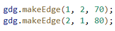

# Laporan Praktikum
**Nama : Rendha Putra Rahmadya**  
**Kelas: D4 - TI 1H** 
**No.Absen : 24**
---

### 2.1 Praktikum 1 : Implementasi Graph menggunakan Linked List

### 2.1.2 Verifikasi Hasil Percobaan
---
### Hasil running pada langkah 14  
  

### Hasil running pada langkah 17
  

### 12.2.3 Jawaban
---

1. Perbaiki kode program Anda apabila terdapat error atau hasil kompilasi kode tidak sesuai!

        public void addFirst(int item, int jarak){
            if (isEmpty()){
            head = new Node24 (null, item, jarak, null);
            }else{
                Node24 newNode = new Node24(null, item, jarak, head);
                head.prev = newNode;
                head = newNode;
            }
            size++;

2. Pada class Graph, terdapat atribut list[] bertipe DoubleLinkedList. Sebutkan tujuan pembuatan variabel tersebut! 

    >Untuk menyimpan data objek DoubleLinkedList sehingga dapat di akses menggunakan index

3. Jelaskan alur kerja dari method __removeEdge__! 

       >pertama input asal dan tujuan, i bernilai 0, selama nilai i kurang dari vertex lakukan pengecekan jika tujuan sama dengan nilai i maka akan dipanggil pada list[asal] untuk menghapus tujuan dari list edge yang terhubung dengan asal

4. Apakah alasan pemnaggilan method __addfirst()__ untuk menambahkan data, bukan method add jenis lain saat digunakan pada method __addEdge__ pada class graph?

        head = new Node(null, item, head);

    >Karena addfirst digunakan untuk menambahkan data pada index pertama, dan pada index pertama prev nya adalah null

5. Modifikasi kode program sehingga dapat dilakukan pengecekan apkaah terdapat jalur antara suatu node dengan node lainnya, seperti contoh berikut (Anda dapat meamnfaatkan Scanner)

        head.prev = newNode ?

    >Arti dari statement tersebut adalah data data yang ditambahkan akan menjadi prev dari data head sebelumnya 

### 2.2 Percobaan 2 : Implementasi Graph menggunakan Matriks  

### 2.2.2 Verifikasi Hasil Percobaan
---

 

### 2.2.3 Jawaban 
---

1. Perbaiki kode program Anda apabila terdapat error atau hasil kompilasi kode tidak sesuai! 

       public void removeEdge(int asal, int tujuan){
        matriks[asal][tujuan] = 0;
    
2. Apa jenis graph yang digunakan pada Percobaan 2? 

    >Graph Matriks

3. Apa maksud dari dua baris kode berikut 

     >Dua baris kode tersebut memiliki maksud untuk menambahkan edge dalam graph. Baris pertama gdg.makeEdge(1, 2, 70); menambahkan edge dari vertex 1 ke vertex 2 dengan bobot 70. Baris kedua gdg.makeEdge(2, 1, 80); menambahkan edge dari vertex 2 ke vertex 1 dengan bobot 80.

4. Modifikasi kode program sehingga terdapat method untuk menghitung degree, termasuk 
inDegree dan outDegree! 

        public void degree(int a) {
        int totIn = 0, totOut = 0;
        
        for (int i = 0; i < vertex; i++) {
            // inDegree
            if (matrix[i][a] != 0) {
                totIn++;
            }
            // outDegree
            if (matrix[a][i] != 0) {
                totOut ++;
            }
        }

        System.out.println("InDegree dari Gedung " + (char) ('A' + a) + ": " + totIn);
        System.out.println("OutDegree dari Gedung " + (char) ('A' + a) + ": " + totOut);
        System.out.println("Degree dari Gedung " + (char) ('A' + a) + ": " + (totIn + totOut));
    }

