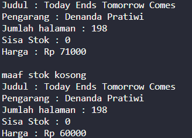
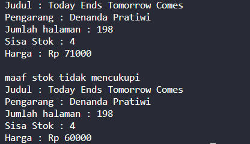
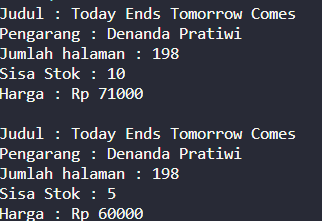

# Laporan Praktikum 
### 2.1 Percobaan 1 : Deklarasi class, Atribut dan Method
---

pada percobaan pertama dalam praktikum 2.1 ini, saya mmebuat file java bernama Buku25.java yang akan di isi atribut dan method seperti pada class diagram dibawah

 

### 2.1.1 Verifikasi Hasil Percobaan
berikut adalah hasil output dari percobaan pertama, dimana hal ini dikarenakan tidak adanya fungsi main dalam file java 

 

### 2.1.2 Jawaban Pertanyaan
---
1. Sebutkan dua karakteristik class atau object
    - Sebuah class default dapat diakses oleh class lain jika class tersebut berada di satu folder yang sama dengan class yang mengakses
    - Sebuah class private hanya bisa diakses oleh class dengan satu file yang sama dengan yang mengakses
2. Perhatikan class Buku pada Praktikum 1 tersebut, ada berapa atribut yang dimiliki oleh class Buku? Sebutkan apa saja atributnya!

    terdapat 5 atribut yaitu :
    - String Judul
    - String Pengarang
    - int halaman
    - int stok 
    - int harga
3. Ada berapa method yang dimiliki oleh class tersebut? Sebutkan apa saja methodnya! 

    terdapat 4 method yaitu : 
    - void tampilinformasi()
    - void terjual(int jml)
    - void restok(int jml)
    - int gantiHarga(int hrg)

4. Perhatikan method terjual() yang terdapat di dalam class Buku. Modifikasi isi method tersebut sehingga proses pengurangan hanya dapat dilakukan jika stok masih ada (lebih besar dari 0)! 

    Saya menambahkan kode seperti berikut, dimana saya menambahkan percabangan dalam method terjual(), hal ini supaya jika stok masih ada dan lebih besar dari 0, maka proses pengurangan dapat dilakukan, namun jika stok lebih kecil dari 0, program tidak akan melakukan pengurangan, begitu pula jika stok adalah 0
     

    berikut adalah hasil outputnya jika stok = 0 

    

    dan berikut adalah hasil output jika stok kurang dari jml input

    

5. Menurut Anda, mengapa method restock() mempunyai satu parameter berupa bilangan int? 

    Karena input yang akan digunakan adalah bilangan bulat, yang mana tipe data untuk input tersebut adalah int

### 2.2 Percobaan 2 : Instansiasi Object, serta mengakses Atribut dan Method
---
Pada percobaan ini saya membuat file baru bernama <b> Bukumain25.java </b> yang akan digunakan untuk menginisiasi object, serta mengakses atribut dan method dari file <b> Buku25.java </b>

### 2.2.1 Verifikasi Hasil Percobaan
----
Berikut adalah hasil output dari percobaan 2

### 2.2.2 Jawaban Pertanyaan
---
1. Pada class BukuMain, tunjukkan baris kode program yang digunakan untuk proses instansiasi! Apa nama object yang dihasilkan?

    untuk melakukan instansiasi pada class <b> Bukumain25.java </b> perlu kode seperti berikut

        Buku25 bk1 = new Buku25();

    yang akan menghasilkan object <b> bk1 </b>

